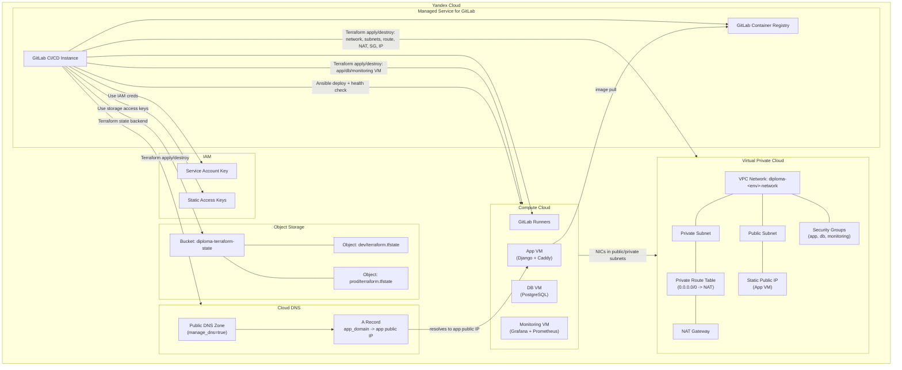
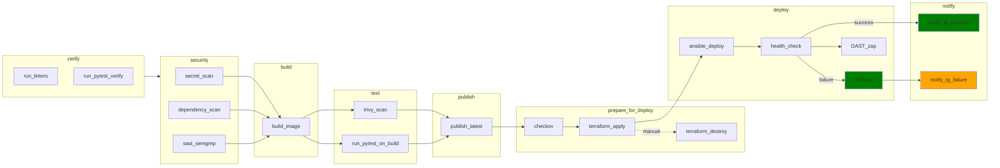

# Deployment of Educational Django Application
Проект содержит автоматизированный GitLab CI/CD pipeline для развертывания Django-приложений в Yandex Cloud.

## Структура репозитория
```
├── .gitlab-ci.yml          # GitLab CI/CD pipeline
├── Dockerfile              # Dockerfile для сборки образа приложения
├── ansible/                # Ansible-роли и плейбуки
├── config/                 # Django settings
├── django_educational_demo_application/  # Django app
├── infra/                  # Terraform-модули для Yandex Cloud
└── tests/                  # Тесты
```

## О приложении
<details>
<summary>Для демонстрации работы пайплайна было разработано MVP веб-приложения "Django Educational Demo Application".</summary>

Это Learning Management System (LMS) для управления образовательными проектами и курсами.
Позволяет преподавателям создавать и управлять курсами, отслеживать прогресс работы над проектами, а студентам выполнять и сдавать задания.
### Основная функциональность
- **Курсы и зачисления** — создание учебных курсов, управление списками студентов
- **Проекты** — создание проектов со статусами (draft → in_progress → review → completed), ссылками на репозитории и развёрнутые приложения
- **Задачи** — разбиение проектов на подзадачи
- **Оценивание** — выставление оценок преподавателем, отслеживание средней оценки студента
- **Статистика** — аналитика по курсам (количество студентов, проектов, средняя оценка)
- **Аутентификация** — регистрация и вход через социальные сети (django-allauth)

### Локальный запуск
```bash
uv venv
uv sync --locked
export DATABASE_URL=postgres://<user>:<pass>@<host>:5432/<db>
uv run python manage.py migrate
uv run python manage.py runserver
```
</details>

## О пайплайне
<details>
<summary>Ключевой фокус проекта - разработка CI/CD pipeline, обеспечивающего полноценный DevOps-процесс.</summary>

### Основная функциональность
- **Автоматическая верификация кода**: security-проверки, сборка и публикация Docker-образов в GitLab Container Registry;
- **Управление инфраструктурой** на основе branch-based правил через Terraform (`apply` / `destroy` для VPC, VM, security groups);
- **Конфигурацию серверов** и деплой через Ansible веб-приложения, базы данных и мониторинга (Prometheus+Grafana);
- **Health-check с автоматическим rollback** приложения для обеспечения 100% удачного развертывания в продакшен;
- **Уведомления в Telegram**[-канал](https://t.me/dedapp_notifications) о статусе пайплайна для увеличения прозрачности процесса и повышения информативности нотификация GitLab.
</details>

## Технологии
<details>
<summary>Проект реализован с использованием следующих инструментов:</summary>

| Категория | Инструменты |
|---|---|
| Application | Django 5.2, Gunicorn, PostgreSQL, Redis |
| CI/CD | GitLab CI, GitLab Container Registry, Kaniko |
| Containerization | Docker, Docker Compose |
| IaC | Terraform (Yandex Cloud provider) |
| Configuration | Ansible |
| Testing | pytest, pytest-django, pre-commit (ruff, djLint) |
| Monitoring | Grafana, Prometheus |
</details>

## Архитектура инфраструктуры
В качестве инфраструктурного слоя использован Yandex Cloud.
### Верхнеуровневая схема инфраструктуры
Все ресурсы организации _organization-yndx-kuzkoalexey_ размещены в облаке _cloud-yndx-kuzkoalexey_.
<details>
<summary>Задействованные ресурсы: Managed Service for Gitlab, Cloud DNS, IAM, Compute Cloud, Object Storage, Virtual Private Cloud</summary>


</details>

## Архитектура CI/CD

### Схема пайплайна


<details>
<summary>Для наглядности диаграмма упрощена.</summary>

> - `run_pytest_on_build` проверяет именно собранный образ: поднимает `postgres` + app-контейнер и запускает `pytest` smoke (`tests/smoke/container_image_smoke.py`)
> - `terraform_apply` для `main` запускается автоматически, для `dev/develop` — вручную
> - `notify_tg_success` запускается `on_success` - когда не осталось pending/failed jobs (не только после `health_check`)
> - `notify_tg_failure` запускается на `on_failure` при любой ошибке (не только после `rollback`)
</details>

### Этапы пайплайна
| Stage | Job                       | Описание                                                                                |
|---|---------------------------|-----------------------------------------------------------------------------------------|
| `verify` | `run_linters`             | pre-commit hooks (ruff, djLint, django-upgrade)                                         |
| `verify` | `run_pytest_verify`              | набор базовых проверок с pytest в CI-окружении (с PostgreSQL service)                   |
| `security` | `secret_scan`             | Поиск секретов в репозитории (`gitleaks`)                                               |
| `security` | `dependency_scan`         | Аудит Python-зависимостей (`pip-audit`)                                                 |
| `security` | `sast_semgrep`            | SAST-проверка исходного кода (`semgrep`)                                                |
| `build` | `build_image`             | Kaniko: сборка и push immutable-образа с тегом `$CI_COMMIT_SHA`                         |
| `build` | `trivy_scan`              | Сканирование собранного образа (`HIGH`, `CRITICAL`)                                     |
| `test` | `run_pytest_on_build` | Smoke-тест собранного образа: запуск `postgres` + app-контейнера и запуск pytest-тестов |
| `publish` | `publish_latest`          | Ретегирование уже собранного образа в `latest-<env>` и `previous-<env>`                 |
| `prepare_for_deploy` | `checkov`                 | Статический анализ Terraform-конфигурации                                               |
| `prepare_for_deploy` | `terraform_apply`         | `terraform apply` + подготовка inventory (auto в `main`, manual в `dev/develop`)        |
| `prepare_for_deploy` | `terraform_destroy`       | Ручной `terraform destroy`                                                              |
| `deploy` | `ansible_deploy`          | Деплой через Ansible + Docker Compose                                                   |
| `deploy` | `health_check`            | Проверка HTTPS `/health` и `/`                                                          |
| `deploy` | `rollback`                | Откат к `previous-<env>` при провале health_check                                       |
| `deploy` | `DAST_zap`                | DAST baseline-скан после успешного health-check                                         |
| `notify` | `notify_tg_success` | Уведомляет в Telegram об успешном завершении пайплайна                                  |
| `notify` | `notify_tg_failure` | Уведомляет в Telegram о провале с указанием конкретной job                              |

<details>
<summary>Правила запуска:</summary>

- Автоматически на push запускаются `verify` → `security` → `build` → `test`
- Для веток `main` (`prod`) и `dev`/`develop` (`dev`) дополнительно запускается `publish_latest`
- В `main` `terraform_apply` запускается автоматически
- В `dev`/`develop` `terraform_apply` доступен как manual job
- `terraform_destroy` остается manual job
- После успешного `terraform_apply` автоматически запускаются jobs этапа `deploy`
- `notify_tg_success` отправляется после успешного `health_check` (для `main` и `dev`/`develop`)
- `notify_tg_failure` отправляется на любой сбой (`on_failure`) в `main` и `dev`/`develop`
- `rollback` и `notify_tg_failure` запускаются при ошибке
</details>

### Реализованная функциональность


<details>
<summary>Полностью реализовано ✅</summary>

- **CI Pipeline:** auto-часть `verify → security → build → test → publish`; в `main` деплойный контур автоматический, в `dev/develop` `terraform_apply`/`terraform_destroy` запускаются вручную; после `terraform_apply` выполняются `deploy → notify`
- **Terraform IaC:** VPC, subnets (public/private), NAT Gateway, security groups, VM (app/db/monitoring), опциональная DNS-зона
- **Ansible деплой:** idempotent-роли для app, db, monitoring; авто-определение docker-compose команды
- **Image Tagging:** commit SHA + `latest-dev/latest-prod` + `previous-dev/previous-prod` (для rollback)
- **Post-build smoke test:** запуск собранного Docker-образа вместе с PostgreSQL и `pytest`-проверка доступности `/health` и `/`
- **Health-check:** HTTPS проверка `/health` и главной страницы с fallback на IP
- **Rollback:** автоматический откат к `previous-<env>` при провале health_check
- **Terraform destroy:** ручное удаление инфраструктуры
- **S3 Backend:** состояние Terraform в Yandex Object Storage (`dev/terraform.tfstate`, `prod/terraform.tfstate`)
- **Изоляция окружений:** отдельные VPC/subnets/NAT для dev и prod
</details>

<details>
<summary>Ограничения ⚠️</summary>

- **Rollback:** хранится только один предыдущий тег (`previous-<env>`); первый деплой откатывать некуда
- **DNS:** при `MANAGE_DNS=true` требуется делегирование NS на регистраторе для ACME challenge
- **Health-check:** fallback на HTTP/IP при некоторых HTTPS-сбоях; strict-fail только для DNS-ошибок (`curl rc=6`)
</details>

### Build vs Publish
<details>
<summary>Шаги `build_image` и `publish_latest` разделены по ответственности</summary>

- `build_image` (Kaniko) собирает Docker-образ из `Dockerfile` и публикует immutable-тег `$CI_COMMIT_SHA`
- `publish_latest` работает уже с опубликованным образом в реестре: переносит `latest-<env>` в `previous-<env>` и ставит `latest-<env>` на текущий SHA

Шаги не дублируют друг друга. Первый создаёт артефакт сборки, второй продвигает его как «текущий» для окружения и подготавливает данные для rollback.
</details>

### Тестирование
<details>
<summary>Реализовано 10 тест-файлов</summary>
- `django_educational_demo_application/users/tests/` (5 файлов: admin, forms, models, urls, views)
- `tests/test_health_endpoint.py`
- `tests/test_home_page.py`
- `tests/test_merge_production_dotenvs_in_dotenv.py`
- `tests/smoke/container_image_smoke.py`
</details>
<details>
<summary>Особенности тестирования</summary>

- Тесты используют PostgreSQL (не совместимы с SQLite из-за sequence в миграциях `contrib/sites`)
- CI запускает pytest с PostgreSQL service
- Пост-сборочный `test` stage запускает pytest против запущенного контейнера
</details>

## Конфигурация

<details>
<summary>Переменные Terraform</summary>


| Переменная | Описание | Пример |
|---|---|---|
| `app_domain` | FQDN приложения | `app.example.com` |
| `manage_dns` | Управлять DNS-зоной через Terraform | `true`/`false` |
| `dns_zone` | Базовая DNS-зона | `example.com` |
| `dns_zone_resource_name` | Имя ресурса DNS-зоны | `diploma-zone-dev` |
| `environment` | Имя окружения | `dev`/`prod` |
</details>

<details>
<summary>Переменные GitLab CI/CD</summary>

| Переменная | Описание | Scope |
|---|---|---|
| `APP_DOMAIN` | Домен приложения (обязательная) | environment |
| `MANAGE_DNS` | Управление DNS (`true`/`false`) | environment |
| `DNS_ZONE` | DNS-зона | environment |
| `DNS_ZONE_RESOURCE_NAME` | Имя зоны в YC DNS | environment |
| `DJANGO_SECRET_KEY` | Секрет Django | environment, masked |
| `DJANGO_ADMIN_URL` | URL админки | environment |
| `DB_USER`, `DB_PASSWORD`, `DB_NAME` | Параметры БД | environment, masked |
| `TLS_ACME_EMAIL` | Email для Let's Encrypt | environment |
| `TELEGRAM_BOT_TOKEN`, `TELEGRAM_CHAT_ID` | Уведомления | masked |
| `YC_SERVICE_ACCOUNT_KEY` | Ключ сервисного аккаунта | masked |
| `SSH_PUBLIC_KEY`, `SSH_PRIVATE_KEY` | SSH ключи | masked |
| `YC_STORAGE_ACCESS_KEY`, `YC_STORAGE_SECRET_KEY` | S3 backend | masked |

**Определение окружения в зависимости от Git branch:**
- `main` → `prod`
- `dev`/`develop` → `dev`
</details>

<details>
<summary>Настройки DNS делегирования</summary>

При `MANAGE_DNS=true` Terraform создаёт публичную DNS-зону и выводит:
- `dns_zone_id`
- `dns_zone_name`
- `dns_delegation_name_servers` (NS-серверы)
Требуется делегирование NS у регистратора для работы ACME challenge (Let's Encrypt).
</details>
